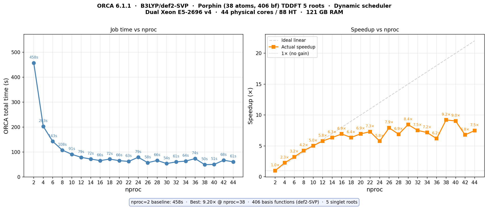
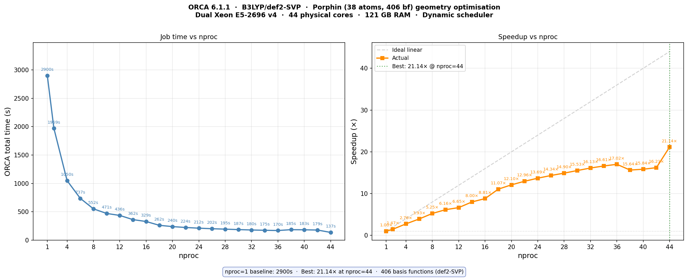

# Porphin Core Scaling

This benchmark measures how small closed-shell ORCA jobs scale with `%pal nprocs`.

## TDDFT/TDA



## Geometry Optimization



## System

- Molecule: porphin
- Charge/multiplicity: 0 1
- Atoms: 38
- Geometry: [`porphin.xyz`](porphin.xyz)

## Calculation

The exact input block is embedded in every `.out` file.

TDDFT/TDA example:

```orca
%pal nprocs 2 end
%maxcore 3000

! B3LYP def2-SVP def2/J RIJCOSX

%tddft
  nroots 5
  triplets false
end

* xyzfile 0 1 /home/jannes/porphin/opt.xyz
```

Geometry-optimization example:

```orca
%pal nprocs 2 end
%maxcore 3000
! B3LYP def2-SVP def2/J RIJCOSX Opt TightOpt
%geom MaxIter 200 end
* xyz 0 1
...
*
```

## Hardware

- CPU: 2x Intel Xeon E5-2696 v4
- Physical cores: 44
- Hardware threads: 88
- RAM: 121 GiB

## Files

- `porphin.xyz`: optimized geometry used by the TDDFT/TDA benchmark.
- `tddft_nproc_*.out`: TDDFT/TDA outputs.
- `opt_nproc_*.out`: geometry-optimization outputs.
- `opt_trj.xyz`: representative geometry-optimization trajectory.
- `tddft-core-scaling.png`: TDDFT/TDA timing and speedup plot.
- `opt-core-scaling.png`: geometry-optimization timing and speedup plot.
