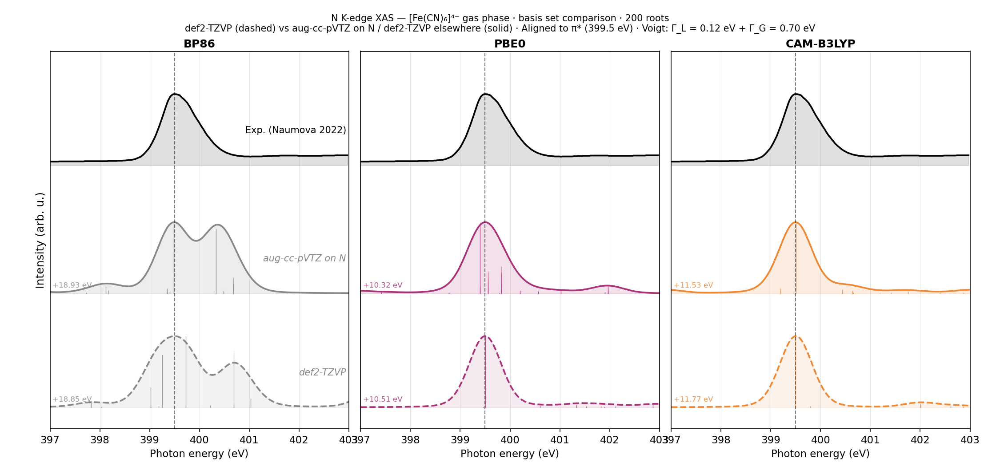

# FeCN6 N K-edge XAS: Basis Set Comparison

Effect of augmenting the N basis on N K-edge TDDFT/TDA spectra of [Fe(CN)6]4-.



## System

- Molecule: [Fe(CN)6]4-
- Charge/multiplicity: -4 1
- Atoms: 13
- Geometry: [`fecn6.xyz`](fecn6.xyz) (PBE0/def2-TZVP optimized)

## Calculation

TDDFT/TDA, 200 roots, orbital window restricted to N 1s (MOs 5-10).
def2-TZVP on all atoms; aug-cc-pVTZ variant swaps in aug-cc-pVTZ on N only.

def2-TZVP input:
```
%pal nprocs 4 end
%maxcore 3000
! BP86 def2-TZVP def2/J RIJCOSX DefGrid3
%tddft
  nroots 200
  OrbWin[0] = 5,10,-1,-1
end
* xyzfile -4 1 fecn6.xyz
```

aug-cc-pVTZ on N input:
```
%pal nprocs 4 end
%maxcore 3000
! BP86 def2-TZVP AutoAux RIJCOSX DefGrid3
%basis
  NewGTO N "aug-cc-pVTZ" end
%tddft
  nroots 200
  OrbWin[0] = 5,10,-1,-1
end
* xyzfile -4 1 fecn6.xyz
```

Spectra aligned to the experimental pi* peak at 399.5 eV (Naumova 2022).
Broadening: Voigt, Gamma_L = 0.12 eV, Gamma_G = 0.70 eV.

## Results

| Functional | Exchange | def2-TZVP | aug-cc-pVTZ on N |
|---|---|---|---|
| BP86 | 0% | poor | poor |
| PBE0 | 25% | moderate | good |
| CAM-B3LYP | range-sep. | moderate | good |

Augmenting only the N basis improves PBE0 and CAM-B3LYP noticeably.
BP86 (pure GGA, no exact exchange) remains poor regardless of basis.

## Hardware

- CPU: 2x Intel Xeon E5-2696 v4
- Physical cores: 44, RAM: 121 GiB
- ORCA: 6.1.1

## Files

- `fecn6.xyz`: optimized geometry.
- `{functional}_def2tzvp.out`: def2-TZVP calculations.
- `{functional}_augN.out`: aug-cc-pVTZ on N calculations.
- `nkxas_basis_comparison.png`: stacked spectra plot (def2-TZVP dashed, aug-cc-pVTZ solid).
