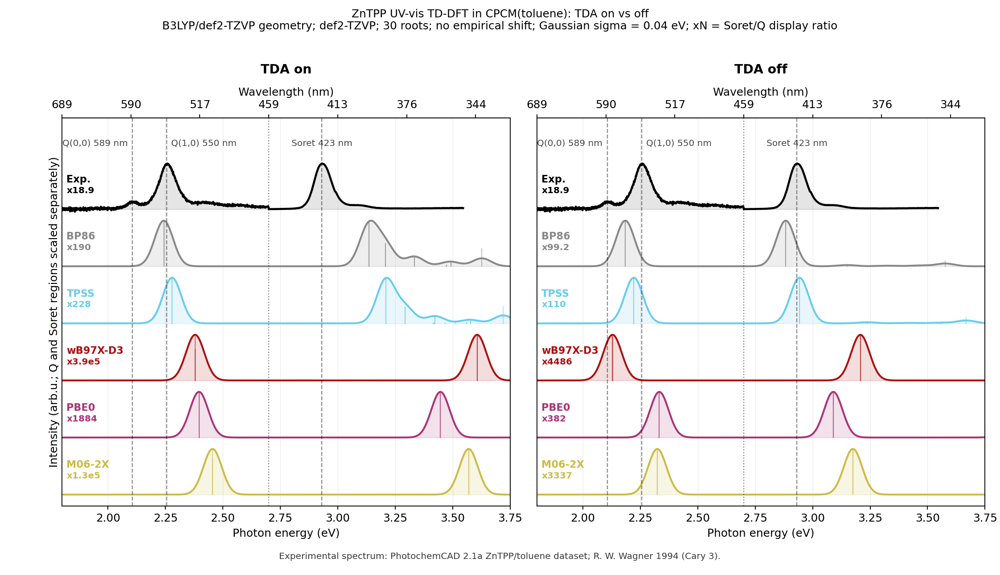

# ZnTPP CPCM Toluene: TDA On vs Off

TD-DFT UV-vis benchmark for zinc tetraphenylporphyrin in CPCM(toluene), comparing
the Tamm-Dancoff approximation against full TD-DFT for five representative
functionals.



## System

- Molecule: ZnTPP, zinc tetraphenylporphyrin
- Charge/multiplicity: 0 1
- Atoms: 77
- Geometry: [`zntpp_b3lyp_tzvp.xyz`](zntpp_b3lyp_tzvp.xyz) (B3LYP/def2-TZVP optimized)
- Experiment: ZnTPP/toluene absorption spectrum from PhotochemCAD 2.1a
  (Wagner 1994, Cary 3 measurement)

## Calculation

TD-DFT, 30 roots, def2-TZVP, RIJCOSX, CPCM(toluene), no empirical energy shift.
The same five functionals are plotted in the same vertical order in both panels:
BP86, TPSS, wB97X-D3, PBE0, M06-2X.

TDA-on input pattern:
```text
%pal nprocs 8 end
%maxcore 3000
! PBE0 def2-TZVP def2/J RIJCOSX DefGrid3 TightSCF CPCM(Toluene)
%tddft
  nroots 30
  triplets false
end
* xyzfile 0 1 zntpp_b3lyp_tzvp.xyz
```

TDA-off variant:
```text
%tddft
  nroots 30
  triplets false
  tda false
end
```

## Peaks

Strongest Q-region transition below 2.7 eV and strongest Soret-region transition
above 2.7 eV, taken directly from the ORCA electric-dipole absorption tables.

| Mode | Functional | Group | Q eV | Q nm | Soret eV | Soret nm |
| --- | --- | --- | ---: | ---: | ---: | ---: |
| TDA on | BP86 | GGA | 2.243 | 553 | 3.135 | 396 |
| TDA on | TPSS | meta-GGA | 2.279 | 544 | 3.209 | 386 |
| TDA on | wB97X-D3 | range-separated hybrid | 2.379 | 521 | 3.607 | 344 |
| TDA on | PBE0 | global hybrid | 2.396 | 517 | 3.447 | 360 |
| TDA on | M06-2X | meta-hybrid | 2.455 | 505 | 3.570 | 347 |
| TDA off | BP86 | GGA | 2.184 | 568 | 2.883 | 430 |
| TDA off | TPSS | meta-GGA | 2.221 | 558 | 2.942 | 421 |
| TDA off | wB97X-D3 | range-separated hybrid | 2.129 | 583 | 3.208 | 387 |
| TDA off | PBE0 | global hybrid | 2.332 | 532 | 3.090 | 401 |
| TDA off | M06-2X | meta-hybrid | 2.323 | 534 | 3.175 | 391 |

Experimental reference markers in the plot: Q(0,0) 589 nm, Q(1,0) 550 nm,
Soret 423 nm. The plot scales the Q and Soret display regions independently;
`xN` labels report the Soret/Q display ratio. Gaussian broadening: sigma =
0.04 eV.

Experimental source: PhotochemCAD 2.1a ZnTPP/toluene absorption dataset,
measured by R. W. Wagner in 1994 on a Cary 3.

## Hardware

- CPU: 2x Intel Xeon E5-2696 v4
- Physical cores: 44, RAM: 121 GiB
- ORCA: 6.1.1

## Files

- `zntpp_b3lyp_tzvp.xyz`: optimized geometry used for TD-DFT.
- `zntpp_b3lyp_tzvp_trj.xyz`: representative optimization trajectory.
- `zntpp_tdaon_*.out`: TD-DFT/TDA outputs.
- `zntpp_tdaoff_*.out`: full TD-DFT outputs (`tda false`).
- `zntpp_photochemcad_abs.txt`: experimental ZnTPP/toluene spectrum.
- `zntpp_tda_comparison_peaks.csv`: parsed Q/Soret peak table.
- `zntpp_cpcm_tda_comparison.png`: scaled Q/Soret comparison plot.
