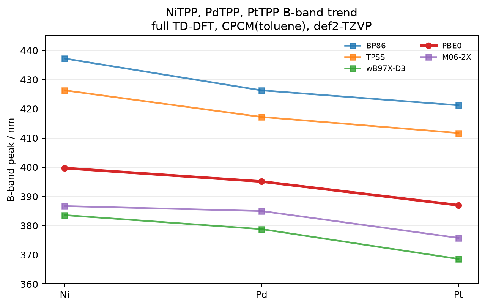

# NiTPP, PdTPP, PtTPP: B-band trend

Full TD-DFT benchmark for NiTPP, PdTPP, and PtTPP in CPCM(toluene), focusing on the B-band trend across the same five functionals used in the ZnTPP comparison.



## System

- Molecules: NiTPP, PdTPP, PtTPP
- Charge/multiplicity: 0 1
- Atoms: 77 each
- Geometries: [`nitpp_b3lyp_tzvp.xyz`](nitpp_b3lyp_tzvp.xyz), [`pdtpp_b3lyp_tzvp.xyz`](pdtpp_b3lyp_tzvp.xyz), [`pttpp_b3lyp_tzvp.xyz`](pttpp_b3lyp_tzvp.xyz)

## Calculation

Full TD-DFT, 30 roots, def2-TZVP, RIJCOSX, CPCM(toluene), no empirical shift. The same five functionals are plotted for all three systems: BP86, TPSS, wB97X-D3, PBE0, and M06-2X.

Representative input:
```text
%pal nprocs 8 end
%maxcore 3000
! PBE0 def2-TZVP def2/J RIJCOSX DefGrid3 TightSCF CPCM(Toluene)
%tddft
  nroots 30
  triplets false
  tda false
end
* xyzfile 0 1 nitpp_b3lyp_tzvp.xyz
```

Across all five functionals, the B band blue-shifts monotonically from Ni to Pd to Pt. PBE0 gives `399.7 -> 395.1 -> 387.0 nm`.

Inspection of the bright PBE0 B-band states shows that the transitions remain predominantly porphyrin-centered, with increasing metal admixture in the frontier virtual pair from Ni to Pt.

## Peaks

TDA-off Q and B peaks taken directly from the ORCA electric-dipole absorption tables.

| Functional | Ni B / nm | Pd B / nm | Pt B / nm |
| --- | ---: | ---: | ---: |
| BP86 | 437.2 | 426.3 | 421.2 |
| TPSS | 426.3 | 417.2 | 411.7 |
| wB97X-D3 | 383.6 | 378.8 | 368.6 |
| PBE0 | 399.7 | 395.1 | 387.0 |
| M06-2X | 386.7 | 385.0 | 375.8 |

## Hardware

- CPU: 2x Intel Xeon E5-2696 v4
- Physical cores: 44, RAM: 121 GiB
- ORCA: 6.1.1

## Files

- `nitpp_b3lyp_tzvp.xyz`, `pdtpp_b3lyp_tzvp.xyz`, `pttpp_b3lyp_tzvp.xyz`: optimized geometries used for TD-DFT.
- `{nitpp,pdtpp,pttpp}_tdaoff_*.out`: full TD-DFT outputs for the five-functionals sweep.
- `ni_pd_pt_bband_peaks.csv`: parsed TDA-off Q/B peak table.
- `ni_pd_pt_bband_trend.png`: B-band trend plot for NiTPP, PdTPP, and PtTPP.
