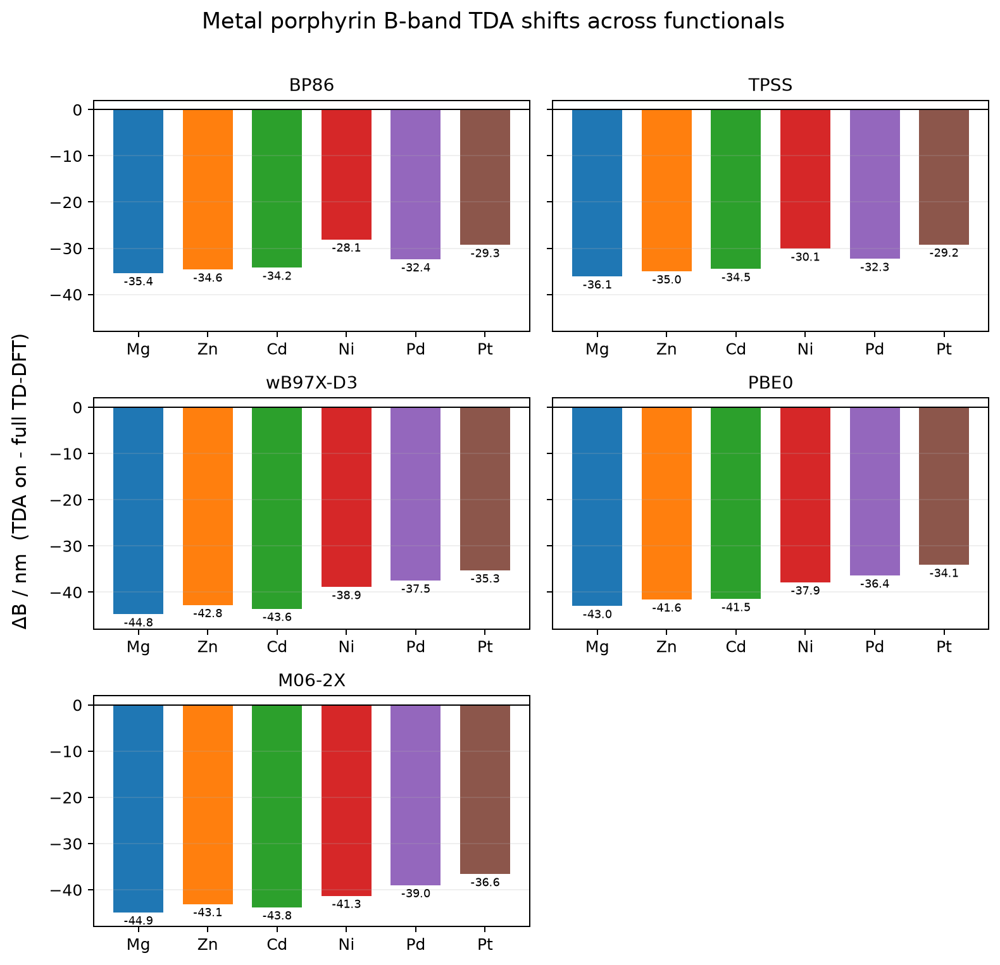

# B-band wavelength shift, Δλ(TDA - full TD-DFT), across metal centers and functionals

B-band shift induced by the Tamm-Dancoff approximation across six metal tetraphenylporphyrins: MgTPP, ZnTPP, CdTPP, NiTPP, PdTPP, and PtTPP.



## System

- Molecules: MgTPP, ZnTPP, CdTPP, NiTPP, PdTPP, PtTPP
- Charge/multiplicity: 0 1
- Atoms: 77 each
- Geometries: `*_b3lyp_tzvp.xyz` files in this folder

## Calculation

TD-DFT UV-vis benchmark in CPCM(toluene), def2-TZVP, RIJCOSX, 30 roots.
The plotted quantity is:

```text
ΔB = λ(TDA on) - λ(full TD-DFT)
```

Negative values therefore mean that TDA blue-shifts the B band relative to full TD-DFT.
Each panel shows one functional across all six metals: BP86, TPSS, wB97X-D3, PBE0, and M06-2X.

Representative TDA-on input:

```text
%pal nprocs 8 end
%maxcore 3000
! PBE0 def2-TZVP def2/J RIJCOSX DefGrid3 TightSCF CPCM(Toluene)
%tddft
  nroots 30
  triplets false
end
* xyzfile 0 1 nitpp_b3lyp_tzvp.xyz
```

Full TD-DFT variant:

```text
%tddft
  nroots 30
  triplets false
  tda false
end
```

## Result

TDA blue-shifts the B band for every metal and every functional in this set.
The shift is largest for the range-separated and meta-hybrid cases, and smaller for NiTPP, PdTPP, and PtTPP than for MgTPP, ZnTPP, and CdTPP.

Inspection of the full TD-DFT excited-state vectors shows NiTPP, PdTPP, and PtTPP have a more crowded set of excited states below and around the B band than MgTPP, ZnTPP, and CdTPP, which suggests stronger metal influence on the spectrum. That same trio also shows the smaller TDA minus full TD-DFT B-band shifts, suggesting the Tamm-Dancoff approximation tracks full TD-DFT a bit more closely for the more electronically involved metal centers.


## Hardware

- CPU: 2x Intel Xeon E5-2696 v4
- Physical cores: 44, RAM: 121 GiB
- ORCA: 6.1.1

## Files

- `*_b3lyp_tzvp.xyz`: optimized geometries used for TD-DFT.
- `*_tdaon_*.out`: TD-DFT/TDA outputs.
- `*_tdaoff_*.out`: full TD-DFT outputs.
- `metal_porphyrin_bband_tda_deltas.csv`: parsed B-band and Q-band TDA deltas.
- `metal_porphyrin_bband_tda_deltas.png`: one panel per functional, all six metals.
