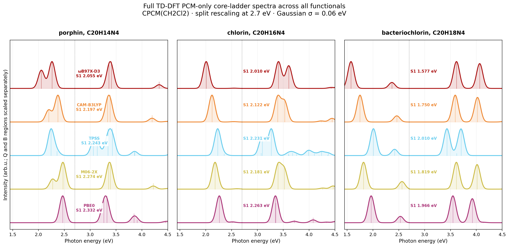

# Porphin -> chlorin -> bacteriochlorin core ladder in CH2Cl2

Full TD-DFT benchmark for the free-base porphyrinoid core ladder in dichloromethane across five functionals.



## System

- Molecules: porphin, chlorin, bacteriochlorin
- Charge/multiplicity: 0 1
- Atoms: 38, 40, 42
- Geometries: `*_opt_b3lypd4_tzvp.xyz`

## Calculation

The geometries were optimized at B3LYP-D4/def2-TZVP and then used for full TD-DFT in CPCM(CH2Cl2), def2-TZVP, RIJCOSX, 30 roots.

Representative input:

```text
%pal nprocs 4 end
%maxcore 3000
! PBE0 def2-TZVP def2/J RIJCOSX DefGrid3 TightSCF CPCM(CH2Cl2)
%tddft
  nroots 30
  tda false
  triplets false
end
* xyzfile 0 1 chlorin_opt_b3lypd4_tzvp.xyz
```

## Result

Across all five functionals, the ladder red-shifts monotonically from porphin to chlorin to bacteriochlorin.
In CH2Cl2, bacteriochlorin places S1 at 1.577 to 2.010 eV, well below porphin at 2.055 to 2.332 eV.

## Hardware

- CPU: 2x Intel Xeon E5-2696 v4
- Physical cores: 44, RAM: 121 GiB
- ORCA: 6.1.1

## Files

- `*_opt_b3lypd4_tzvp.xyz`: optimized geometries used for TD-DFT.
- `*_ch2cl2_*.out`: full TD-DFT outputs in CPCM(CH2Cl2).
- `core_ladder_ch2cl2_s1_s2.csv`: parsed S1 and S2 energies.
- `core_ladder_ch2cl2.png`: one panel per functional across the three-core ladder.
- `core_ladder_ch2cl2.svg`: editable vector version of the same plot.
