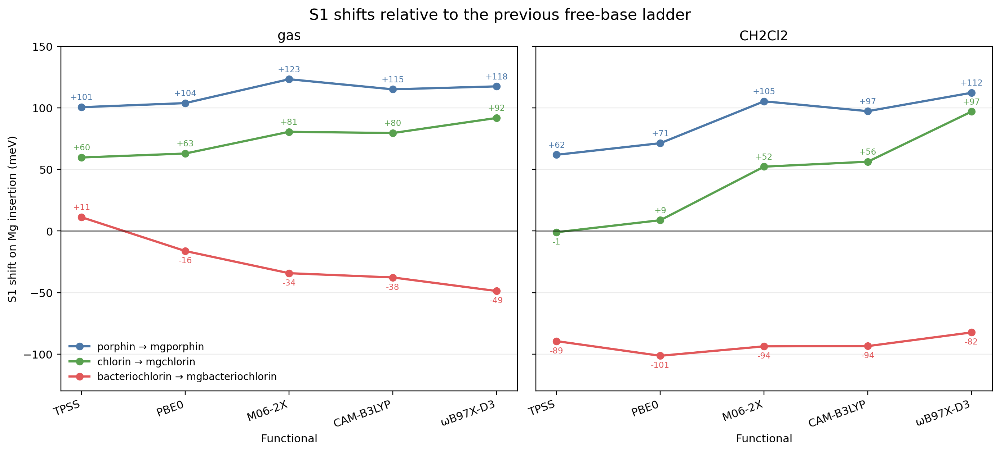

# Mg insertion shifts across the porphyrinoid core ladder

Full TD-DFT benchmark for Mg insertion into porphin, chlorin, and bacteriochlorin, compared against the matched free-base ladder in gas phase and CH2Cl2.



## System

- Molecules: Mg-porphin, Mg-chlorin, Mg-bacteriochlorin
- Charge/multiplicity: 0 1
- Atoms: 37, 39, 41
- Geometries: `*_opt_b3lypd4_tzvp.xyz`

## Calculation

The Mg-core geometries were optimized at B3LYP-D4/def2-TZVP and then used for full TD-DFT with 30 roots.
Gas-phase and CPCM(CH2Cl2) calculations were both run with the same def2-TZVP, RIJCOSX, DefGrid3, TightSCF setup.

Representative CH2Cl2 input:

```text
%pal nprocs 4 end
%maxcore 3000
! PBE0 def2-TZVP def2/J RIJCOSX DefGrid3 TightSCF CPCM(CH2Cl2)
%tddft
  nroots 30
  tda false
  triplets false
end
* xyzfile 0 1 mgporphin_opt_b3lypd4_tzvp.xyz
```

## Result

Mg insertion blue-shifts porphin and chlorin, but red-shifts bacteriochlorin.
In CH2Cl2 the bacteriochlorin shift is consistently negative, from -82 to -101 meV across the five-functional set.

## Hardware

- CPU: 2x Intel Xeon E5-2696 v4
- Physical cores: 44, RAM: 121 GiB
- ORCA: 6.1.1

## Files

- `*_opt_b3lypd4_tzvp.xyz`: optimized geometries used for TD-DFT.
- `*_gas_*.out`: gas-phase full TD-DFT outputs.
- `*_ch2cl2_*.out`: CPCM(CH2Cl2) full TD-DFT outputs.
- `mg_core_ladder_s1_shifts.csv`: parsed S1 shifts relative to the free-base ladder.
- `mg_core_ladder_s1_shifts.png`: gas-phase and CH2Cl2 S1 shift summary.
