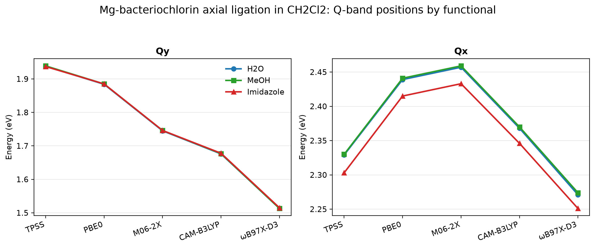
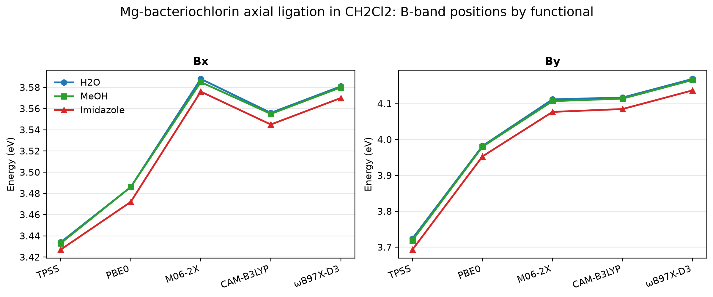
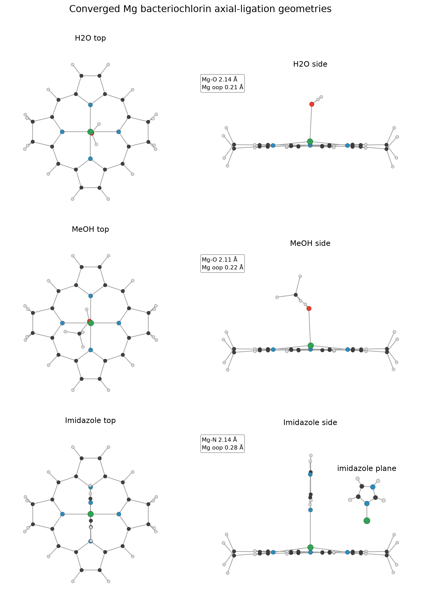

# Axial ligation sensitivity of Mg-bacteriochlorin in CH2Cl2

Full TD-DFT benchmark for three simple axial ligands on Mg-bacteriochlorin: H2O, MeOH, and imidazole.







## System

- Molecules: Mg-bacteriochlorin(H2O), Mg-bacteriochlorin(MeOH), Mg-bacteriochlorin(imidazole)
- Charge/multiplicity: 0 1
- Geometries: `mgbacteriochlorin_*_opt_b3lypd4_tzvp.xyz`

## Calculation

The ligated geometries were optimized at B3LYP-D4/def2-TZVP and then used for full TD-DFT in CPCM(CH2Cl2), def2-TZVP, RIJCOSX, 30 roots.

Representative input:

```text
%pal nprocs 4 end
%maxcore 3000
! PBE0 def2-TZVP def2/J RIJCOSX DefGrid3 TightSCF CPCM(CH2Cl2)
%tddft
  nroots 30
  tda false
  triplets false
end
* xyzfile 0 1 mgbacteriochlorin_imidazole_opt_b3lypd4_tzvp.xyz
```

## Result

H2O and MeOH are nearly indistinguishable in this set.
Imidazole leaves Qy almost unchanged, but shifts Qx and the B-band pair slightly to higher energy across the five-functional sweep.

## Hardware

- CPU: 2x Intel Xeon E5-2696 v4
- Physical cores: 44, RAM: 121 GiB
- ORCA: 6.1.1

## Files

- `mgbacteriochlorin_*_opt_b3lypd4_tzvp.xyz`: optimized geometries used for TD-DFT.
- `mgbacteriochlorin_*_ch2cl2_*.out`: CPCM(CH2Cl2) full TD-DFT outputs.
- `mgbacteriochlorin_axial_ligation_peaks.csv`: parsed Q and B peak assignments.
- `mgbacteriochlorin_axial_ligation_qbands.png`: Qx and Qy comparison across ligands and functionals.
- `mgbacteriochlorin_axial_ligation_bbands.png`: Bx and By comparison across ligands and functionals.
- `mgbacteriochlorin_axlig_geometry_compare.png`: side-by-side optimized geometry comparison for the three axial ligands.
