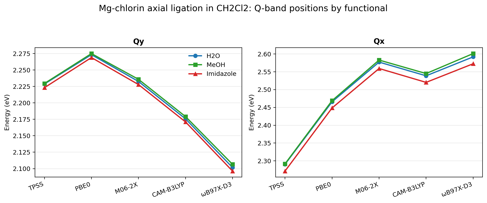
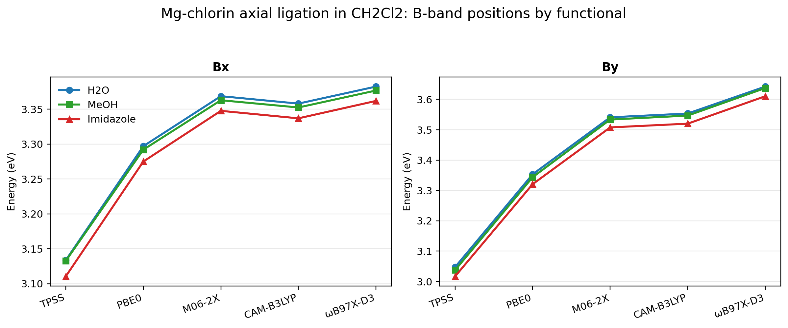
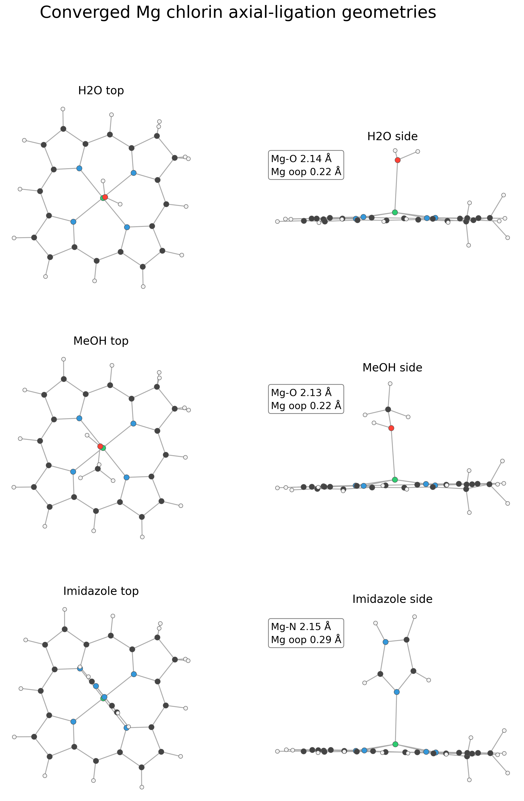

# Axial ligation sensitivity of Mg-chlorin in CH2Cl2

Full TD-DFT benchmark for three simple axial ligands on Mg-chlorin: H2O, MeOH, and imidazole.







## System

- Molecules: Mg-chlorin(H2O), Mg-chlorin(MeOH), Mg-chlorin(imidazole)
- Charge/multiplicity: 0 1
- Geometries: `mgchlorin_*_opt_b3lypd4_tzvp.xyz`

## Calculation

The ligated geometries were optimized at B3LYP-D4/def2-TZVP and then used for full TD-DFT in CPCM(CH2Cl2), def2-TZVP, RIJCOSX, 30 roots.

Representative input:

```text
%pal nprocs 4 end
%maxcore 3000
! PBE0 def2-TZVP def2/J RIJCOSX DefGrid3 TightSCF CPCM(CH2Cl2)
%tddft
  nroots 30
  tda false
  triplets false
end
* xyzfile 0 1 mgchlorin_h2o_opt_b3lypd4_tzvp.xyz
```

## Result

H2O and MeOH are nearly indistinguishable. Relative to H2O, imidazole lowers Qy by 4.4-5.6 meV, Qx by 17.2-19.3 meV, Bx by 20.5-23.1 meV, and By by 30.6-33.4 meV across the five-functional sweep. Compared with Mg-bacteriochlorin, Mg-chlorin shows a larger imidazole shift for Qy and Bx, a smaller shift for Qx, a similar By shift, and less functional-to-functional variation overall.

## Hardware

- CPU: 2x Intel Xeon E5-2696 v4
- Physical cores: 44, RAM: 121 GiB
- ORCA: 6.1.1

## Files

- `mgchlorin_*_opt_b3lypd4_tzvp.xyz`: optimized geometries used for TD-DFT.
- `mgchlorin_*_ch2cl2_*.out`: CPCM(CH2Cl2) full TD-DFT outputs.
- `mgchlorin_axial_ligation_peaks.csv`: parsed Q and B peak assignments, energies, and oscillator strengths.
- `mgchlorin_axial_ligation_qbands.png`: Qy and Qx comparison across ligands and functionals.
- `mgchlorin_axial_ligation_bbands.png`: Bx and By comparison across ligands and functionals.
- `mgchlorin_axlig_geometry_compare.png`: side-by-side optimized geometry comparison for the three axial ligands.
