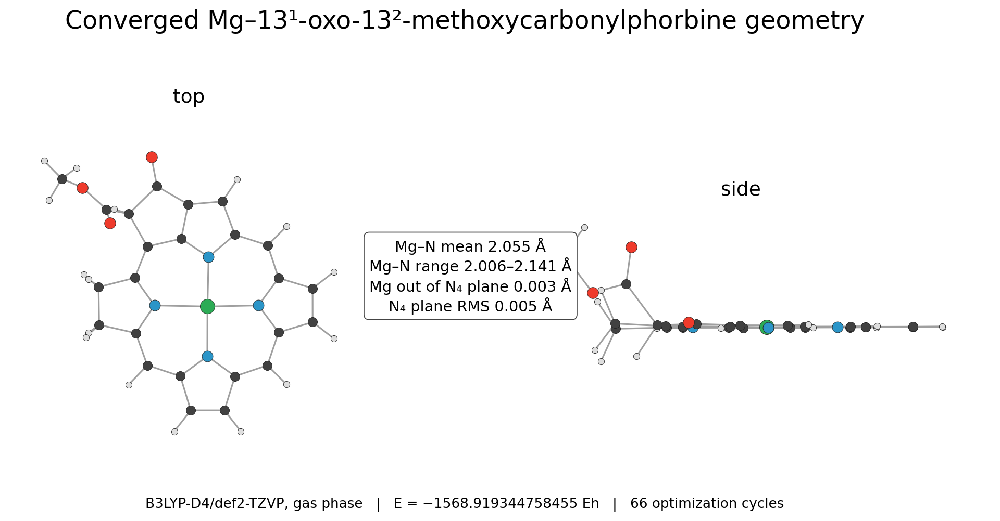
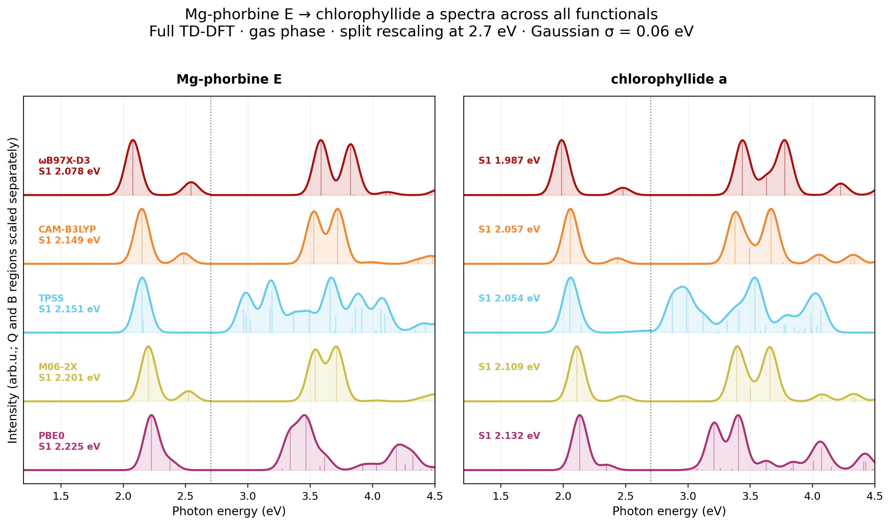
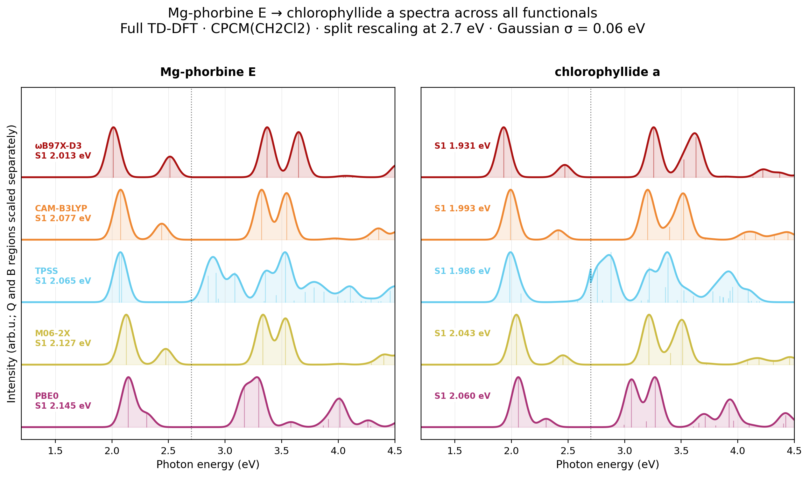
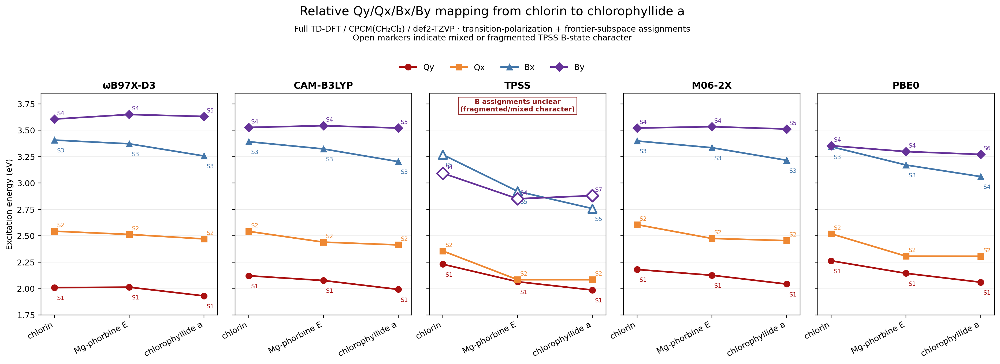
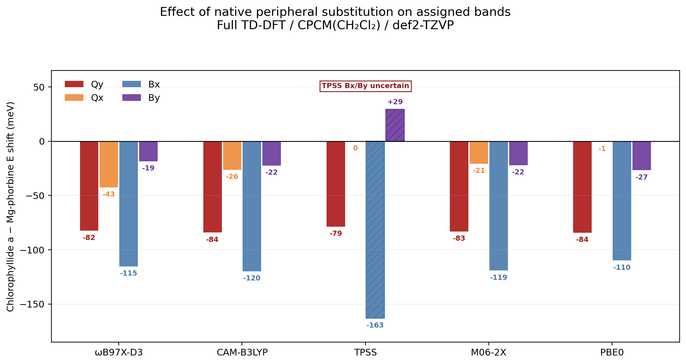

# Chlorophyllide growth: structures and spectra

Controlled growth from minimal Mg-phorbine E to chlorophyllide a, with chlorin as an earlier-core spectral reference. The direct Mg-phorbine E to chlorophyllide a comparison isolates the native peripheral pattern most closely.












## System

- Chlorin, C20H16N4: neutral singlet reference from benchmark 006
- Mg-13^1-oxo-13^2-methoxycarbonylphorbine, C24H16MgN4O3: neutral singlet
- Chlorophyllide a, C35H34MgN4O5: neutral singlet
- Chlorin to Mg-phorbine E changes metalation and introduces fused ring E; only Mg-phorbine E to chlorophyllide a is treated as the peripheral-substitution comparison.

## Calculation

Mg-phorbine E and chlorophyllide a were optimized in the gas phase at B3LYP-D4/def2-TZVP with RIJCOSX, TightOpt, and TightSCF.

Full TD-DFT calculations used 30 singlet roots, def2-TZVP, RIJCOSX, DefGrid3, and TightSCF. The growth pair was calculated in the gas phase and with CPCM(CH2Cl2). The three-system Qy/Qx/Bx/By map uses only CPCM(CH2Cl2), where all calculations use full TD-DFT; chlorin gas results were excluded because that earlier set used TDA.

Representative TD-DFT input:

```text
%pal nprocs 4 end
%maxcore 2200
! PBE0 def2-TZVP def2/J RIJCOSX DefGrid3 TightSCF CPCM(CH2Cl2)
%tddft
  nroots 30
  tda false
  triplets false
end
* xyzfile 0 1 <optimized_geometry.xyz>
```

Qy/Qx/Bx/By assignments combine transition-dipole polarization with Gouterman frontier-orbital family character. Open markers identify mixed or fragmented assignments.

## Result

Both geometry optimizations converged and retained nearly planar MgN4 cores.

Adding the native chlorophyllide a peripheral pattern red-shifts S1 for every functional: 91 to 96 meV in the gas phase and 79 to 84 meV in CPCM(CH2Cl2). Across the four hybrid functionals, peripheral substitution strongly red-shifts Qy and Bx, while Qx and By move less.

| Band | Hybrid-functional shift (meV) | TPSS shift (meV) |
| --- | ---: | ---: |
| Qy | -84 to -82 | -79 |
| Qx | -43 to -1 | 0 |
| Bx | -120 to -110 | -163, uncertain |
| By | -27 to -19 | +29, uncertain |

TPSS is the least robust functional for band interpretation in this set, not demonstrably the least accurate against experiment. Non-Gouterman pi-pi* and substituent-influenced states enter the Soret region, mix with the frontier B configurations, and redistribute oscillator strength across several roots. This behavior is consistent with a semilocal functional with no exact exchange and greater self-interaction/delocalization error; it does not indicate failed TD-DFT convergence.

## Hardware

- CPU: 2x Intel Xeon E5-2696 v4
- Geometry optimizations: 8 processes, 2500 MB maxcore per process
- Growth-pair TD-DFT: 4 processes, 2200 MB maxcore per process
- Chlorin TD-DFT reference: 4 processes, 3000 MB maxcore per process
- RAM: 121 GiB
- ORCA: 6.1.1

## Files

- `*_opt_b3lypd4_tzvp.out` and `*.xyz`: converged optimization records and geometries used for TD-DFT.
- `*_geometry_review.png`: top/side structural checks.
- `*_gas_*.out`: gas-phase full TD-DFT outputs for Mg-phorbine E and chlorophyllide a.
- `*_ch2cl2_*.out`: CPCM(CH2Cl2) full TD-DFT outputs for all three systems.
- `chlorophyllide_growth_s1_s2.csv`: matched S1/S2 energies for the growth pair.
- `chlorin_phorbine_chlorophyllide_ch2cl2_band_assignments.csv`: assigned roots, energies, transition dipoles, frontier-family weights, confidence, and source files.
- Four spectral `.png` figures and two geometry-review `.png` figures; matching spectral `.svg` files provide editable versions.
