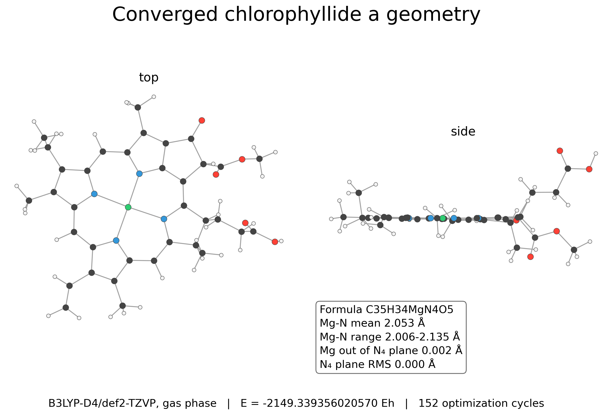
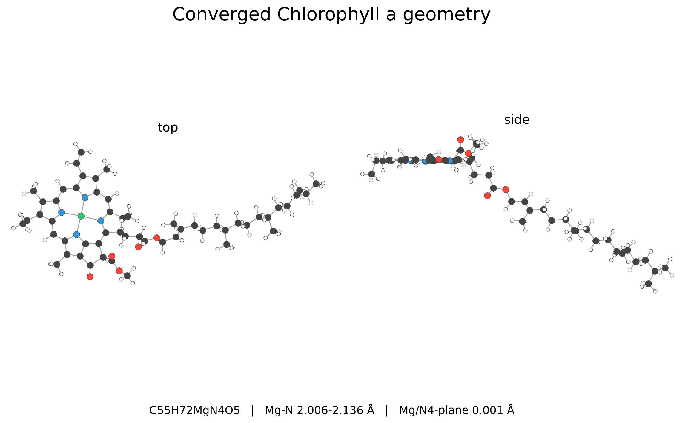
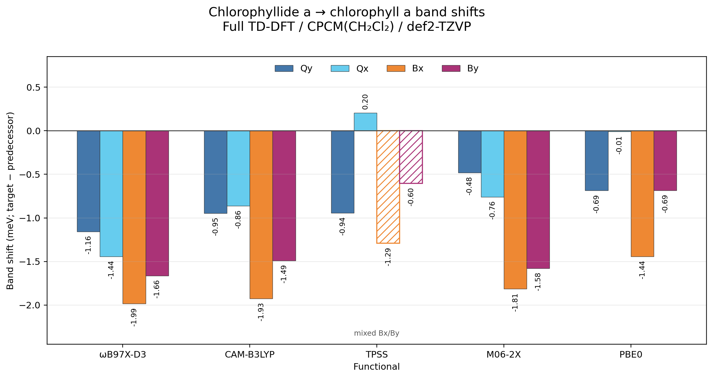

# Chlorophyll a phytol-truncation test

Matched chlorophyllide a to chlorophyll a comparison testing whether the phytyl ester perturbs the chromophore excitation energies.

## System

- Chlorophyllide a, C35H34MgN4O5, 79 atoms
- Chlorophyll a, C55H72MgN4O5, 137 atoms
- Neutral singlets, charge/multiplicity 0 1

## Calculation

Geometries were optimized at B3LYP-D4/def2-TZVP with RIJCOSX, TightOpt, and TightSCF. Full TD-DFT used 30 singlet roots, def2-TZVP, RIJCOSX, DefGrid3, TightSCF, and CPCM(CH2Cl2), with `tda false`.

## Result

Phytol attachment has negligible chromophore-level impact. Across all five functionals, the assigned Qy, Qx, Bx, and By shifts remain within 2 meV. TPSS B assignments are mixed, but their matched shifts are also small.

## Hardware

- CPU: 2x Intel Xeon E5-2696 v4
- Geometry optimization: 8 processes, 2500 MB maxcore per process
- TD-DFT: 4 processes, 2200 MB maxcore per process
- RAM: 121 GiB
- ORCA: 6.1.1

## Files

- `*_opt_b3lypd4_tzvp.out` and `*.xyz`: converged optimization records and final geometries.
- `*_ch2cl2_*.out`: matched full TD-DFT outputs.
- `chlorophyllide_a_chlorophyll_a_ch2cl2_band_shifts.csv`: assigned roots, energies, oscillator strengths, Gouterman-family weights, confidence, and portable provenance.
- `chlorophyllide_a_chlorophyll_a_ch2cl2_band_shifts.png`: matched Qy/Qx/Bx/By shifts.
