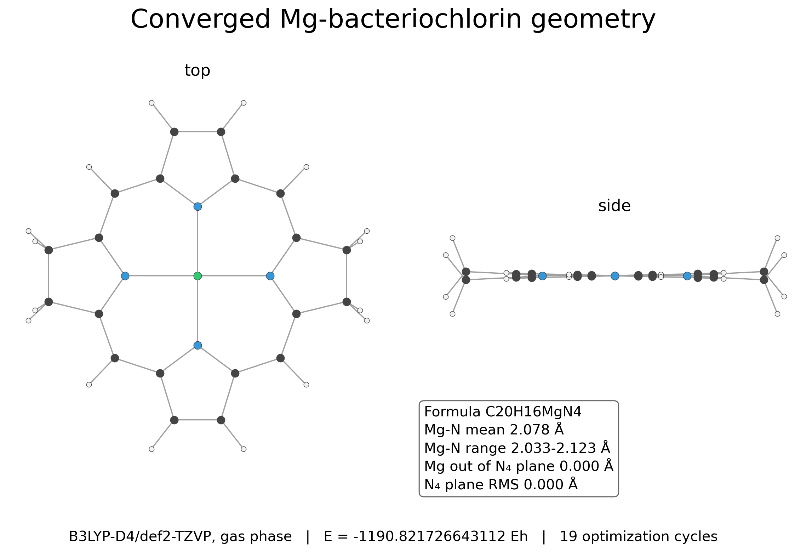
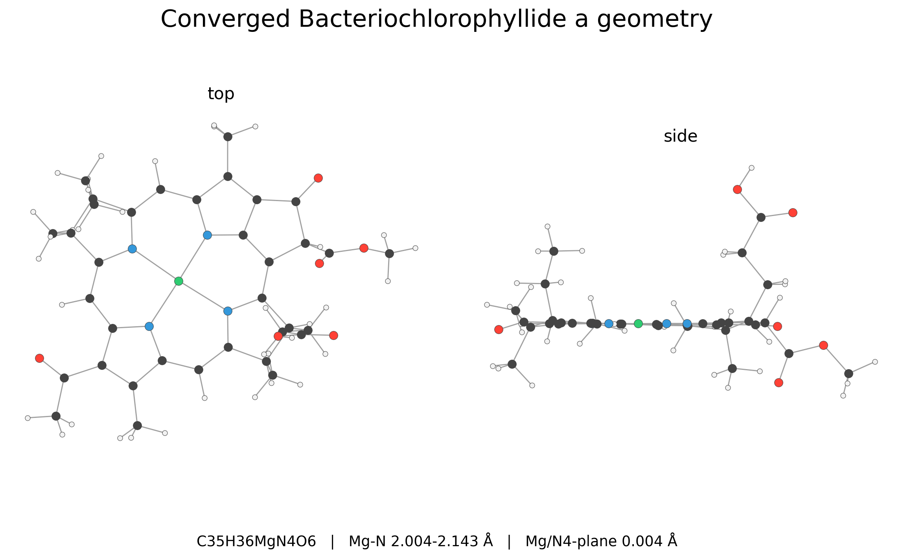
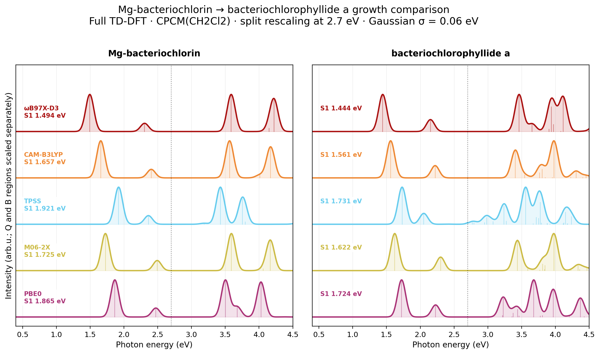
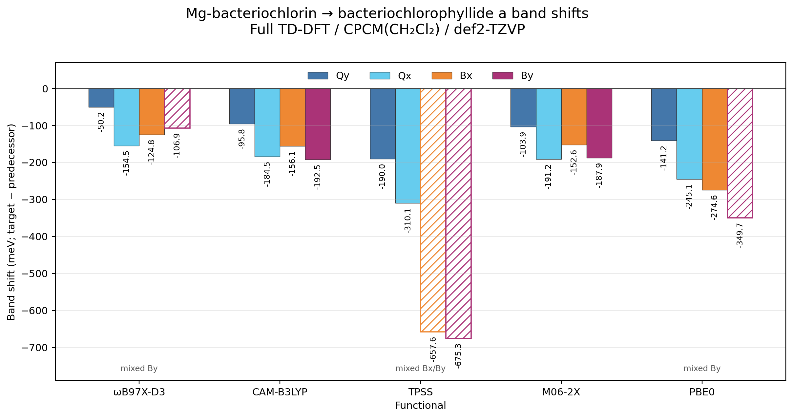

# Bacteriochlorophyllide a growth from Mg-bacteriochlorin

Matched Mg-bacteriochlorin to bacteriochlorophyllide a comparison showing how ring-E and other peripherals reshape the bacteriochlorin spectrum.

## System

- Mg-bacteriochlorin, C20H16MgN4, 41 atoms
- Bacteriochlorophyllide a, C35H36MgN4O6, 82 atoms
- Neutral singlets, charge/multiplicity 0 1

## Calculation

Geometries were optimized at B3LYP-D4/def2-TZVP with RIJCOSX, TightOpt, and TightSCF. Full TD-DFT used 30 singlet roots, def2-TZVP, RIJCOSX, DefGrid3, TightSCF, and CPCM(CH2Cl2), with `tda false`.

The spectra use Gaussian broadening with sigma = 0.06 eV and separate Q/B normalization at 2.7 eV. Qy/Qx/Bx/By assignments combine Gouterman frontier-family weights with transition-dipole polarization. Hatched bars mark fragmented representative B roots.

## Result

Growth to bacteriochlorophyllide a red-shifts Qy by 50 to 190 meV and Qx by 155 to 310 meV across the five functionals. The B region is more functional-dependent because non-Gouterman pi-pi* states mix with and split the Bx/By families, especially for TPSS.

## Hardware

- CPU: 2x Intel Xeon E5-2696 v4
- Geometry optimization: 8 processes, 2500 MB maxcore per process
- TD-DFT: 4 processes, 2200 MB maxcore per process
- RAM: 121 GiB
- ORCA: 6.1.1

## Files

- `*_opt_b3lypd4_tzvp.out` and `*.xyz`: converged optimization records and final geometries.
- `*_ch2cl2_*.out`: matched full TD-DFT outputs.
- `mgbacteriochlorin_bacteriochlorophyllide_a_ch2cl2_band_shifts.csv`: assigned roots, energies, oscillator strengths, Gouterman-family weights, confidence, and portable provenance.
- `*_spectra.png` and `*_band_shifts.png`: matched spectral figures.
