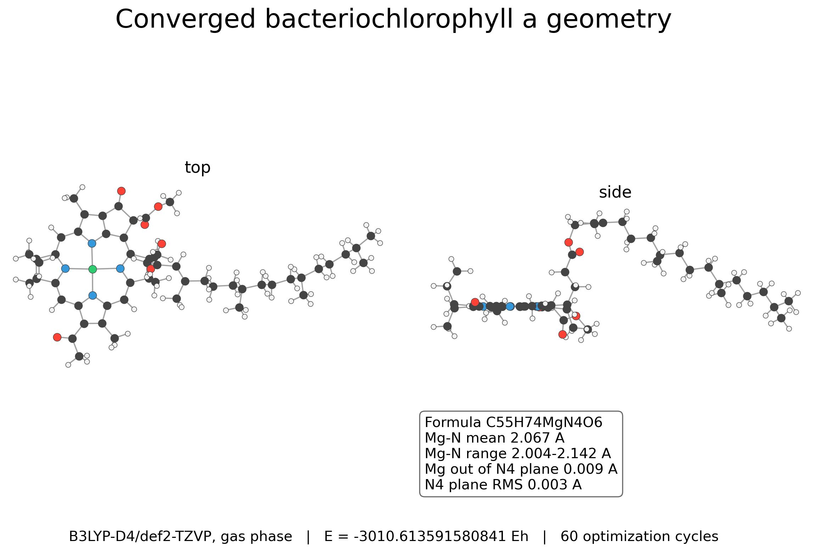
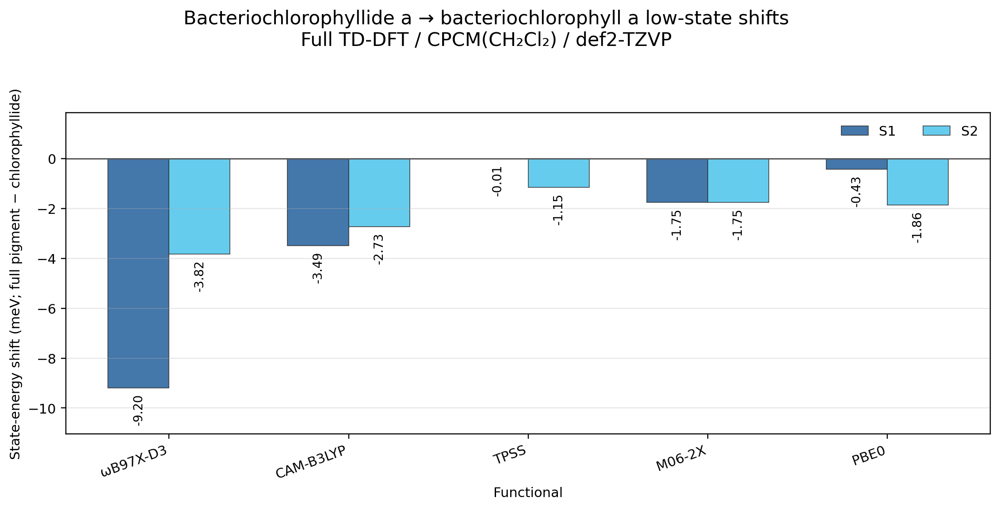

# Bacteriochlorophyll a phytol-truncation test

Matched bacteriochlorophyllide a to bacteriochlorophyll a comparison testing whether the phytyl ester perturbs the low-energy spectrum.

## System

- Bacteriochlorophyllide a, C35H36MgN4O6, 82 atoms
- Bacteriochlorophyll a, C55H74MgN4O6, 140 atoms
- Neutral singlets, charge/multiplicity 0 1

## Calculation

Geometries were optimized at B3LYP-D4/def2-TZVP with RIJCOSX, TightOpt, and TightSCF. Full TD-DFT used 30 singlet roots, def2-TZVP, RIJCOSX, DefGrid3, TightSCF, and CPCM(CH2Cl2), with `tda false`.

## Result

Phytol attachment has little low-energy impact. Across the five functionals, S1 shifts by 0.01 to 9.20 meV and S2 by 1.15 to 3.82 meV, all to lower energy. These are root-based low-state comparisons, not Q-band assignments.

## Hardware

- CPU: 2x Intel Xeon E5-2696 v4
- Geometry optimization: 8 processes, 2500 MB maxcore per process
- TD-DFT: 4 processes, 2200 MB maxcore per process
- RAM: 121 GiB
- ORCA: 6.1.1

## Files

- `*_opt_b3lypd4_tzvp.out` and `*.xyz`: converged optimization records and final geometries.
- `*_ch2cl2_*.out`: matched full TD-DFT outputs.
- `bacteriochlorophyllide_a_bacteriochlorophyll_a_ch2cl2_low_states.csv`: S1/S2 energies, shifts, and portable provenance.
- `bacteriochlorophyllide_a_bacteriochlorophyll_a_ch2cl2_low_state_shifts.png`: matched S1/S2 shifts.
